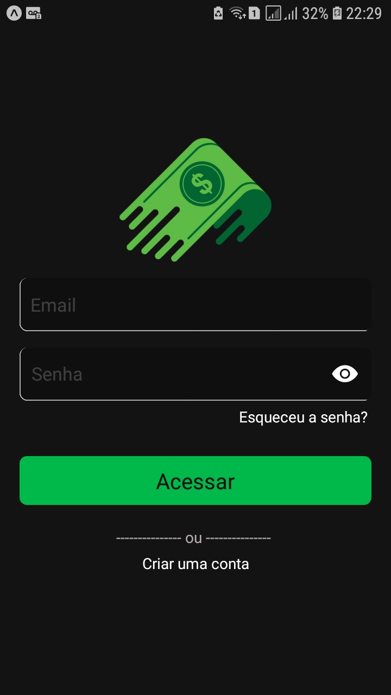
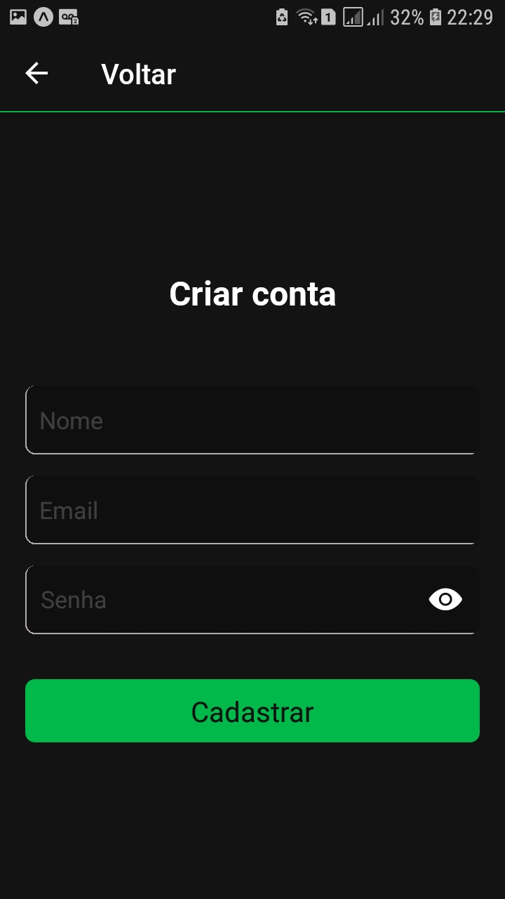
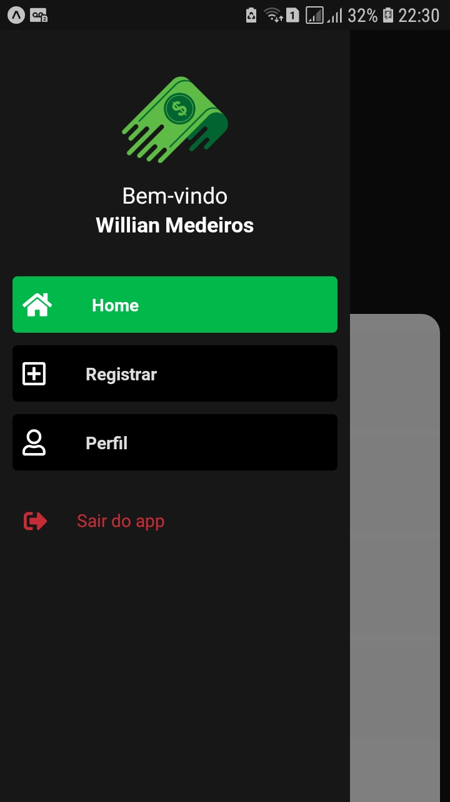
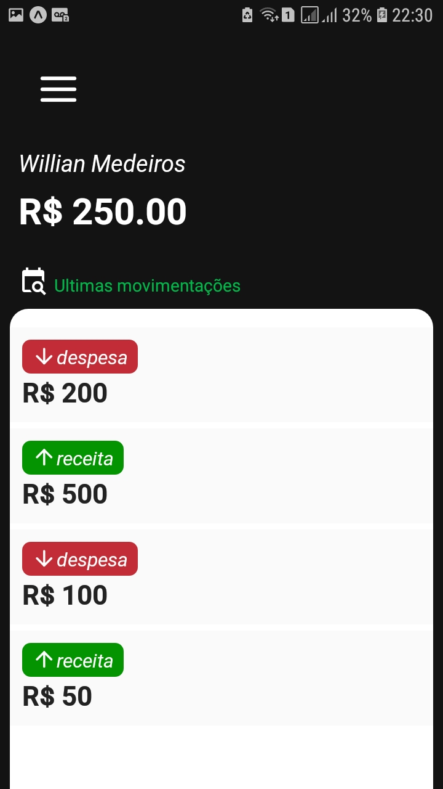

<h1 align="center">
  
</h1>

 

## 💻 Projeto

O App Finanças é um aplicativo criado no curso <a href="https://sujeitoprogramador.com/fabricadeaplicativos/">Fábrica de aplicativos</a> do <a href="https://sujeitoprogramador.com/"> Sujeito Programador</a> 💰.  
Aplicativo no qual tem como objetivo fixar os conhecimentos adquiridos no módulo de Firebase com React native no curso, e mostrar a ultilização do firebase em uma aplicação com todas as camadas, desde autenticação até o salvamento e consumo de dados com Realtime Database.

## ✅ Features que eu adcionei após o término do app feito no curso
- Botão de mostrar e esconder senha
- Estilização do menu 
- Criação e implementação da tela para trocar a senha

## 🎁Capturas de tela de como ficou o aplicativo
<h1 align="center">
  
  
  
  
</h1>

Mais informaçoes e visualização de um vídeo no qual mostra o aplicativo funcionando, pode ser encontrado neste [link](https://www.linkedin.com/in/williandsmedeiros/) na minha conta no LinkedIn.
 
## 🚀 Tecnologias e bibliotecas

Esse projeto foi desenvolvido com as seguintes tecnologias e bibliotecas:

- [Expo](https://expo.io/)
- [npx create-react-native-app](https://github.com/expo/create-react-native-app) 
- [yarn add styled-components](https://styled-components.com/)
- [yarn add firebase](https://firebase.google.com/)
- [expo install @react-native-async-storage/async-storage](https://docs.expo.io/versions/latest/sdk/async-storage/)
- Context API   

-----------   [Navegação](https://reactnavigation.org/)   -------------
- [yarn add @react-navigation/native](https://reactnavigation.org/docs/getting-started/#installation)
- [expo install react-native-gesture-handler react-native-reanimated react-native-screens react-native-safe-area-context @react-native-community/masked-view](https://reactnavigation.org/docs/getting-started/#installing-dependencies-into-an-expo-managed-project)
- [yarn add @react-navigation/stack](https://reactnavigation.org/docs/hello-react-navigation/#installing-the-stack-navigator-library)
- [yarn add @react-navigation/drawer](https://reactnavigation.org/docs/drawer-based-navigation/)  

-----------   [Picker](https://docs.expo.io/versions/latest/sdk/picker/)   -------------
- [expo install @react-native-picker/picker](https://docs.expo.io/versions/latest/sdk/picker/#installation)  

-----------   [Data](https://date-fns.org/)   -------------
- [yarn add date-fns](https://github.com/date-fns/date-fns)  

-----------   [Calendário](https://docs.expo.io/versions/latest/sdk/date-time-picker/)   -------------
- [expo install @react-native-community/datetimepicker](https://docs.expo.io/versions/latest/sdk/date-time-picker/#installation)  

Feito com ❤️ e dedicação by Willian Medeiros